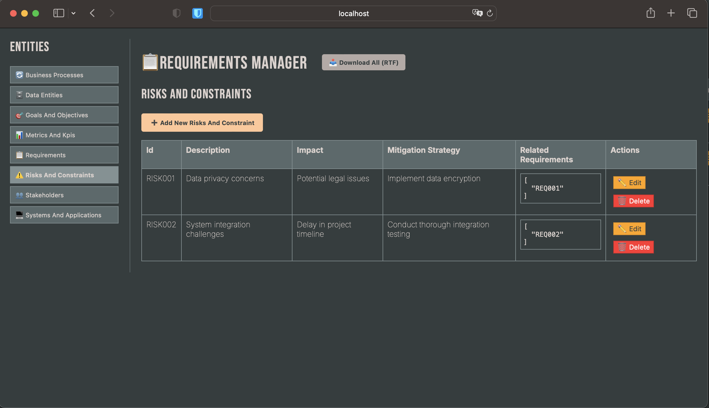

# ReqAI - Requirements Management with AI Search

ReqAI is a lightweight requirements management system with built-in semantic search capabilities, requiring only a Python runtime for deployment, because small is beautiful ...

## Key Features

- **Zero Dependencies** - Runs with just Python standard library
- **AI-Powered Search** - Find similar requirements using semantic similarity
- **Simple Deployment** - Single-file server with built-in web UI
- **RTF Export** - Generate formatted documentation with one click



## Requirements

- Python 3.6+
- Modern web browser (Chrome, Firefox, Edge, Safari)

## Getting Started

1. Clone the repository:
```bash
git clone https://github.com/your-repo/ReqAI.git
cd ReqAI
```

2. Run the server:
```bash
python api.py
```

3. Open your browser to:
```
http://localhost:8000
```

## AI Search Capabilities

ReqAI includes an on-demand semantic search engine that:

- Uses the Xenova/all-MiniLM-L6-v2 model (loaded from CDN)
- Calculates cosine similarity between requirement descriptions
- Shows results ranked by relevance score
- Requires no local ML dependencies

The search index is built automatically when viewing requirements.

## Architecture

```
ReqAI
├── api.py        # Python server (single file)
├── app.js        # Frontend logic
├── index.html    # Web interface
└── *.json        # Data storage
```

## Deployment Options

### Local Development
```bash
python api.py
```

### Production
For production use, consider:
- Running behind nginx/apache
- Using systemd to manage the process
- Setting up regular backups of the JSON data files

## License

MIT License - Free for personal and commercial use
